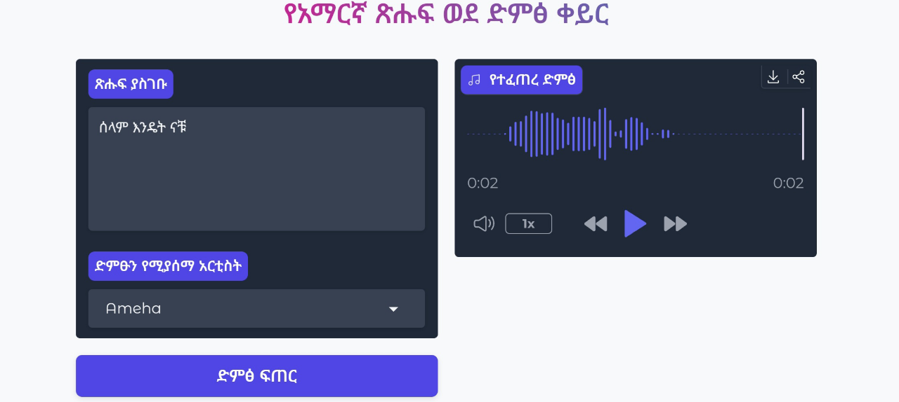

# Bilingual Text-to-Speech (Amharic & English) 🇪🇹🇬🇧🇨🇦

[](https://opensource.org/licenses/MIT)
[](https://www.python.org/downloads/)
[](https://huggingface.co/spaces/snackshell/eng-amh-tts)

<div align="center">
  
  <br>
  <em>Convert text to natural speech in Amharic and English</em>
</div>

## ✨ Features
- 🌍 **Bilingual Support:** Generate speech in both Amharic and English.
- 🗣️ **Multiple Voices:** Choose from four natural-sounding voices.
- 🔄 **Dynamic UI:** Voice options automatically update based on the selected language.
- ⚡ **Real-time Generation:** Powered by Microsoft Edge's online TTS service.
- 🎧 **In-browser Playback:** Listen to the generated audio directly in the app.
- 🎨 **Modern Interface:** Clean, themed UI built with Gradio.
- ⏱️ **Timeout Protection:** Prevents long-running requests from crashing the app.

## 🎶 Supported Voices
| Language      | Name         | Gender | Voice ID              |
|---------------|--------------|--------|-----------------------|
| Amharic 🇪🇹    | Ameha        | Male   | `am-ET-AmehaNeural`   |
| Amharic 🇪🇹    | Mekdes       | Female | `am-ET-MekdesNeural`  |
| English 🇬🇧    | Ryan         | Male   | `en-GB-RyanNeural`    |
| English 🇨🇦    | Clara        | Female | `en-CA-ClaraNeural`   |

## ⚙️ Installation
1.  Clone the repository:
    ```bash
    git clone [https://github.com/snackshell/eng-amh-tts.git](https://github.com/snackshell/eng-amh-tts.git)
    cd eng-amh-tts
    ```

2.  Create and activate a virtual environment:
    ```bash
    # Create the environment
    python -m venv venv

    # Activate on Linux/Mac
    source venv/bin/activate
    
    # Activate on Windows
    venv\Scripts\activate
    ```
    
3.  Install the required packages:
    ```bash
    pip install -r requirements.txt
    ```

## 🚀 Usage
Run the Gradio application with the following command:
```bash
python app.py
